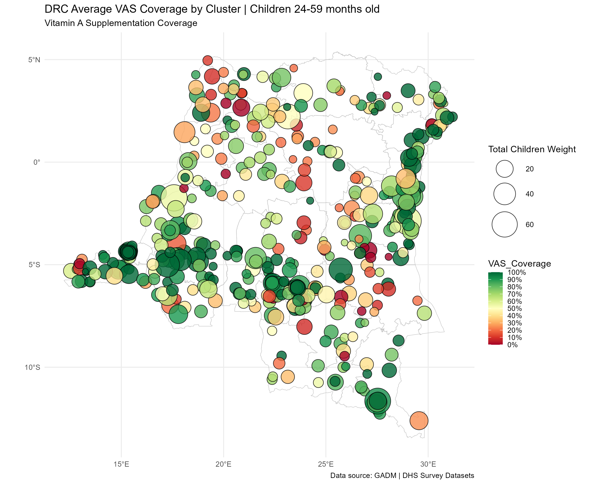

# VAS_Optimization
## DHS Survey Spatial Analysis and Interactive Decision Tree Model for Optimizing Vitamin A Supplementation (VAS) Coverage in African Countries. Project developed for [Reforma Global Consulting](https://www.linkedin.com/company/reformaglobalconsulting/). Some results, code chunks, information and datasets may be hidden due to privacy policies.
-----------------------------------------------------------------------------------------------------------------------------------------------

### We conducted an extensive GPS based data extraction, transformation and load (ETL) process, consolidating household sample data from The DHS Program Survey, GPS and SPA datasets with geospatial open sources like GADM and OpenStreetMap. Using econometric models we assessed the impact of key factors, such as household’s wealth, urban/rural residence or distance to the nearest health facility, on VAS Coverage outcomes at the level of household's cluster and children cluster. Afterwards, we modeled different scenarios to evaluate the changes in coverage outcomes while changing service delivery modality, place of residence and supplies availability, while estimating the associated average costs of each intervention per each child covered. Several GIS (Geographic Information Systems) visualizations were provided, along with a full report and summary tables for our clients. The main results provided by the spatial analysis were added to costing estimates and scenario simulations to develop the final product for our clients: an interactive decision tree model in Excel sheets.
-----------------------------------------------------------------------------------------------------------------------------------------------
For details contact [Stefano Balbo](https://www.linkedin.com/in/stefano-balbo13/) & [Lucia Raquel Corball](https://www.linkedin.com/in/lucia-raquel-corball-455499133/). For requesting access to datasets contact [The DHS Program](https://dhsprogram.com/)
